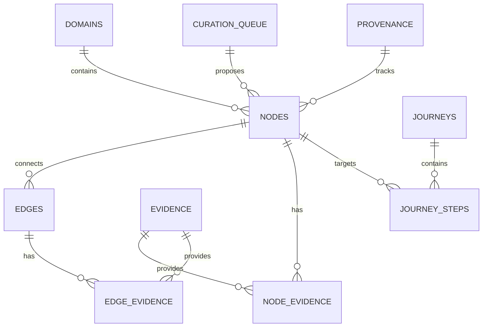

# Database Schema

Azure Atlas uses a customized PostgreSQL 16 database to store the ontology. It features a normalized schema optimized for graph traversals and full-text search.

## Entity-Relationship Diagram

The following diagram illustrates the key tables and their relationships within the ontology:

## Key Tables

-   **`domains`**: High-level categories (e.g., Network, Storage, Compute).
-   **`nodes`**: The fundamental entities in the ontology (e.g., Virtual Network, Azure Storage).
-   **`edges`**: Relationships between nodes (e.g., `Virtual Network` -> `contains` -> `Subnet`).
-   **`evidence`**: Snippets and links to official Microsoft documentation.
-   **`journeys`**: Curated learning paths through the ontology.
-   **`curation_queue`**: Pending changes to the ontology awaiting approval.
-   **`analytics_events`**: User interaction and system tracking events.

## Design Decisions

Azure Atlas incorporates several specific design choices to ensure data integrity and query efficiency:

-   **Text Primary Keys:** Nodes and domains use human-readable text slugs as primary keys (e.g., `azure-vnet`, `networking`). This makes URLs and queries more intuitive.
-   **UUID PKs:** Edges, evidence, and journey steps use UUIDs for primary keys to support distributed generation and avoid sequence collisions.
-   **Full-Text Search (FTS):** Generated `tsvector` columns are used for high-performance searching across node names and descriptions.
-   **Cycle Prevention:** A database-level trigger on the `edges` table prevents circular dependencies in hierarchical relationships.
-   **Status Workflow:** A `content_status_enum` tracks the lifecycle of nodes and edges from `draft` to `approved`.

## Migration and Seeding

The database schema is managed via migration scripts located in `apps/api/migrations/`. 

Ontology content is applied using seed files in `packages/ontology/seed_*.sql`. These seeds are idempotent and can be re-run safely without duplicating data.

!!! tip "Custom Types"
    Azure Atlas uses custom PostgreSQL enums for `node_type` and `relation_type` to enforce strict data modeling at the database level.
