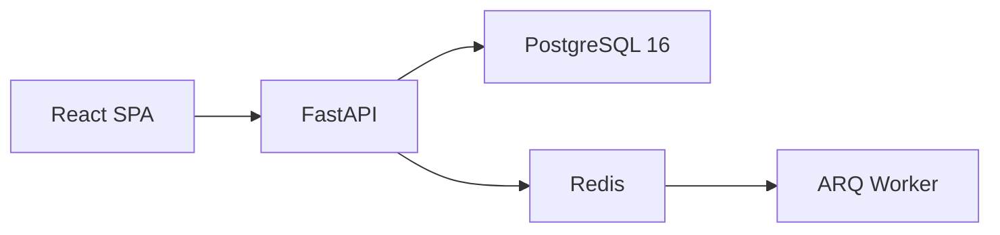

# Architecture Overview

Azure Atlas is built as a modern, containerized monorepo. It features a high-performance Python backend and a reactive TypeScript frontend, all connected by a robust PostgreSQL-based ontology.

## High-Level Architecture

The following diagram illustrates the primary components and data flow:

## Tech Stack

| Layer | Technology |
| ----- | ---------- |
| **Frontend** | React 18, Vite, TypeScript, React Flow, TanStack Query |
| **Backend** | FastAPI, asyncpg, Pydantic v2 |
| **Database** | PostgreSQL 16 (with full-text search) |
| **Caching/Queue** | Redis, ARQ |
| **Infrastructure** | Podman, GitHub Actions |

## Monorepo Structure

The repository is organized into distinct packages and applications:

-   `apps/api/`: The FastAPI backend server.
-   `apps/web/`: The React frontend application.
-   `packages/ontology/`: Shared ontology data, seed SQL files, and migration scripts.
-   `docs/`: Project documentation (MkDocs).

## Data Flow

1.  **Request:** The React frontend makes an asynchronous request to the FastAPI backend using TanStack Query.
2.  **Processing:** The backend validates the request using Pydantic models and executes queries against PostgreSQL using `asyncpg` for high performance.
3.  **Caching:** Frequently accessed domain and node data are cached in Redis to reduce database load.
4.  **Background Tasks:** Long-running operations like ontology indexing or document scraping are offloaded to an ARQ worker process.
5.  **Response:** The processed data is returned to the frontend as a structured JSON response and rendered into the interactive graph.

!!! tip "Performance Focus"
    By using an asynchronous stack from top to bottom (React -> FastAPI -> asyncpg), Azure Atlas can handle complex graph queries with minimal latency.
